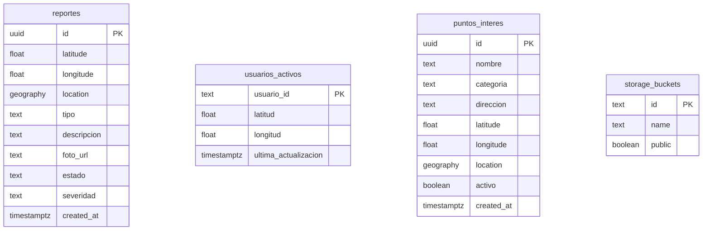

# Base de datos — MovilizaTJ

Backend: **Supabase** (PostgreSQL 15+ con **PostGIS**).

Scripts SQL en `supabase/`:

| Archivo | Propósito |
|---------|-----------|
| `schema.sql` | Esquema base (obligatorio) |
| `puntos-interes.sql` | Tabla POI + seed Tijuana |
| `seed-reportes.sql` | Datos de prueba |
| `migration_from_v1.sql` | Migración desde versión anterior |

---

## Extensiones

```sql
create extension if not exists "pgcrypto";
create extension if not exists "postgis";
```

- `pgcrypto`: UUIDs (`gen_random_uuid()`)
- `postgis`: columnas `geography`, índices espaciales GIST

---

## Tabla `reportes`

Reportes ciudadanos de barreras de movilidad.

### Columnas

| Columna | Tipo | Default | Descripción |
|---------|------|---------|-------------|
| `id` | `uuid` | `gen_random_uuid()` | PK |
| `latitude` | `double precision` | — | Latitud WGS84 |
| `longitude` | `double precision` | — | Longitud WGS84 |
| `location` | `geography(Point,4326)` | GENERATED | Punto PostGIS derivado |
| `tipo` | `text` | `obstaculo_general` | Tipo de barrera |
| `descripcion` | `text` | NULL | Descripción libre |
| `foto_url` | `text` | NULL | URL pública en Storage |
| `estado` | `text` | `pendiente` | Ciclo de vida |
| `severidad` | `text` | `media` | Impacto |
| `created_at` | `timestamptz` | `now()` | Fecha de creación |

### Constraints

**`tipo`** — valores permitidos:
- `banqueta_danada`
- `rampa_bloqueada`
- `bache`
- `sin_rampa`
- `transporte_inaccesible`
- `obstaculo_general`

**`estado`** — valores permitidos:
- `pendiente` — recién reportado
- `verificado` — confirmado por la comunidad o moderador
- `resuelto` — barrera ya no presente
- `rechazado` — reporte inválido

**`severidad`** — valores permitidos:
- `baja`, `media`, `alta`

### Índices

```sql
create index reportes_location_idx on reportes using gist (location);
create index reportes_created_at_idx on reportes (created_at desc);
create index reportes_estado_idx on reportes (estado);
```

### Columnas opcionales de auditoría

El PATCH en `/api/reports/[id]` intenta escribir `resolved_at` y `resolved_via` al marcar `resuelto`. Si no existen, reintenta sin ellas.

Para habilitarlas:

```sql
alter table public.reportes
  add column if not exists resolved_at timestamptz,
  add column if not exists resolved_via text;
```

---

## Tabla `usuarios_activos`

Tracking de ubicación GPS (uso analítico / futuro).

| Columna | Tipo | Descripción |
|---------|------|-------------|
| `usuario_id` | `text` PK | Identificador (default app: `anonimo_tj`) |
| `latitud` | `double precision` | Última latitud |
| `longitud` | `double precision` | Última longitud |
| `ultima_actualizacion` | `timestamptz` | Timestamp del último ping |

Upsert vía `POST /api/locations`.

---

## Tabla `puntos_interes`

Catálogo de lugares institucionales en Tijuana.

| Columna | Tipo | Default | Descripción |
|---------|------|---------|-------------|
| `id` | `uuid` | `gen_random_uuid()` | PK |
| `nombre` | `text` | — | Nombre del lugar |
| `categoria` | `text` | — | Categoría institucional |
| `direccion` | `text` | NULL | Dirección |
| `latitude` | `double precision` | — | Latitud |
| `longitude` | `double precision` | — | Longitud |
| `location` | `geography(Point,4326)` | GENERATED | Punto PostGIS |
| `activo` | `boolean` | `true` | Visible en API |
| `created_at` | `timestamptz` | `now()` | — |

### Categorías permitidas

`imss`, `issste`, `hospital`, `dif`, `cespt`, `farmacia`, `transporte`, `parque`, `educacion`, `gobierno`

### Seed incluido

20 POIs reales (IMSS, hospitales, DIF, CESPT, transporte, parques, educación, gobierno). Ver `puntos-interes.sql`.

---

## Storage: bucket `reportes-fotos`

```sql
insert into storage.buckets (id, name, public)
values ('reportes-fotos', 'reportes-fotos', true)
on conflict (id) do nothing;
```

| Aspecto | Configuración |
|---------|---------------|
| Público | Sí (lectura) |
| Upload | Solo `service_role` |
| Ruta archivos | `{timestamp}-{uuid}.{ext}` |
| URL | `{SUPABASE_URL}/storage/v1/object/public/reportes-fotos/{path}` |

---

## Row Level Security (RLS)

RLS está **habilitado** en todas las tablas públicas.

### `reportes`

| Política | Rol | Operación | Condición |
|----------|-----|-----------|-----------|
| Service role full access reportes | `service_role` | ALL | `true` |
| Public read reportes activos | `anon`, `authenticated` | SELECT | `estado IN ('pendiente', 'verificado')` |

Los ciudadanos **no insertan directamente** vía anon key; el servidor usa service role.

### `usuarios_activos`

| Política | Rol | Operación |
|----------|-----|-----------|
| Service role full access usuarios_activos | `service_role` | ALL |

### `puntos_interes`

| Política | Rol | Operación | Condición |
|----------|-----|-----------|-----------|
| Public read pois | `anon`, `authenticated` | SELECT | `activo = true` |
| Service role full access pois | `service_role` | ALL | `true` |

### Storage `objects`

| Política | Operación | Condición |
|----------|-----------|-----------|
| Public read report photos | SELECT | `bucket_id = 'reportes-fotos'` |
| Service role upload report photos | INSERT | `bucket_id = 'reportes-fotos'` |

---

## Realtime

Habilitar manualmente en Supabase Dashboard:

**Database → Replication → `reportes` → Enable**

Canal en cliente (`hooks/use-reports.ts`):

```typescript
supabase
  .channel("reportes-live")
  .on("postgres_changes", { event: "INSERT", schema: "public", table: "reportes" }, ...)
  .on("postgres_changes", { event: "UPDATE", schema: "public", table: "reportes" }, ...)
  .subscribe();
```

Eventos UPDATE con `estado = 'resuelto' | 'rechazado'` eliminan el marcador del mapa en todos los clientes conectados.

---

## Diagrama entidad-relación



No hay FKs entre tablas: `reportes` y `puntos_interes` son independientes. La relación espacial se calcula en aplicación (Haversine / PostGIS en queries futuras).

---

## Consultas útiles

### Reportes activos recientes

```sql
select id, tipo, severidad, estado, created_at
from public.reportes
where estado in ('pendiente', 'verificado')
order by created_at desc
limit 20;
```

### Reportes cerca de un punto (PostGIS)

```sql
select id, tipo, descripcion,
       ST_Distance(
         location,
         ST_SetSRID(ST_MakePoint(-117.0382, 32.5149), 4326)::geography
       ) as distancia_m
from public.reportes
where estado in ('pendiente', 'verificado')
  and ST_DWithin(
        location,
        ST_SetSRID(ST_MakePoint(-117.0382, 32.5149), 4326)::geography,
        500
      )
order by distancia_m;
```

### POIs por categoría

```sql
select categoria, count(*)
from public.puntos_interes
where activo = true
group by categoria
order by categoria;
```

### Marcar reporte resuelto (admin manual)

```sql
update public.reportes
set estado = 'resuelto'
where id = 'UUID-DEL-REPORTE';
```

---

## Migración desde v1

Si ya tenías una tabla `reportes` sin columnas nuevas, ejecutar `migration_from_v1.sql` o descomentar al final de `schema.sql`:

```sql
alter table public.reportes add column if not exists tipo text not null default 'obstaculo_general';
alter table public.reportes add column if not exists descripcion text;
alter table public.reportes add column if not exists foto_url text;
alter table public.reportes add column if not exists estado text not null default 'pendiente';
alter table public.reportes add column if not exists severidad text not null default 'media';
```

---

## Backup y mantenimiento

Recomendaciones Supabase:

- **Backups automáticos** incluidos en plan Pro; en Free tier exportar manualmente.
- **Retención reportes resueltos:** considerar job periódico para archivar o purgar reportes `resuelto` > 90 días.
- **Índice GIST:** mantener `VACUUM ANALYZE` periódico si el volumen de reportes crece (> 10k filas).

---

## Límites de la aplicación

| Límite | Valor | Ubicación |
|--------|-------|-----------|
| Reportes en mapa (API GET) | 50 | `app/api/reports/route.ts` |
| Reportes en estado cliente | 50 | `REPORT_LIMIT` en `lib/constants.ts` |
| Proximidad toast | 40 m | `hooks/use-proximity-prompt.ts` |
| Cierre reporte (servidor) | 60 m | `app/api/reports/[id]/route.ts` |
| Barreras para score POI | 500 m radio | `app/api/pois/route.ts` |
| POI search radius default | 8000 m | `app/api/pois/route.ts` |
